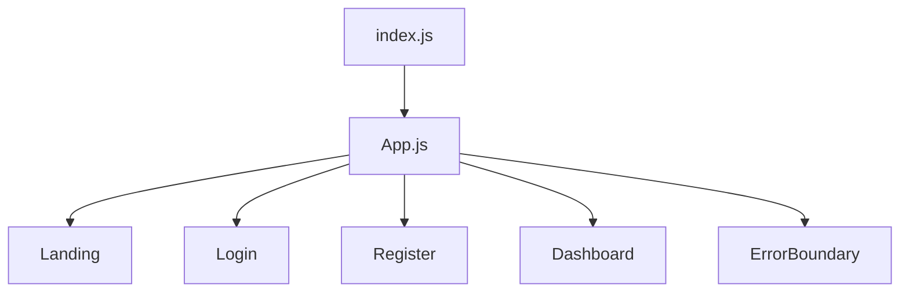

# FRONTEND ARCHITECTURE

## Framework architecture
- **React (CRA)** SPA with route-based pages and hooks-driven state.
- `BrowserRouter` controls client navigation.
- `ErrorBoundary` provides crash containment around router tree.

## Component hierarchy

## Routing system
- `/` -> Landing
- `/register`, `/login` -> wrapped in `PublicRoute`
- `/dashboard` -> wrapped in `ProtectedRoute`
- Guard condition: JWT token presence in localStorage.

## State management
- Local page state via `useState`.
- No Redux/Zustand/Context state container.
- Dashboard holds task list, form payload, filter, loading/error flags.

## Hooks usage rationale
- `useState`: small-scope reactive local state
- `useEffect`: lifecycle side effects for initial data fetch/cleanup
- `useNavigate`/`useLocation`: routing transitions and flash messages

## Rendering lifecycle (Dashboard)
1. Initial render with loading true
2. `useEffect` starts async fetch
3. On response, `setTasks` + `setLoading(false)`
4. UI reconciles list diff; task actions trigger subsequent rerenders

## API communication
- Axios instance in `config/api.js` centralizes base URL, timeout, and JSON headers.
- Token injection done by helper `createAuthHeaders()`.
- Endpoints stored in `API_ENDPOINTS` constants to avoid hardcoded repetition.

## Form handling and validation
- Controlled inputs (`value` + `onChange`).
- Register validates confirm-password and min length before API call.
- Server validation still authoritative for security.

## Styling architecture
- Plain CSS files, mostly page-scoped imports.
- Responsive media queries in each page stylesheet.
- No CSS-in-JS or utility framework.

## Performance considerations
- Current scale is small; no virtualization or code splitting beyond CRA defaults.
- Potential rerender inefficiency from inline handlers and full array updates.
- Missing memoization is acceptable at small task counts but may degrade at large scale.

## Accessibility and UX
- Semantic forms and buttons are present.
- Missing advanced a11y patterns (aria labels, focus management for errors, keyboard traps).

## Industry tradeoffs
- This approach is simple and teachable.
- At enterprise scale, teams usually add:
  - query/state libraries (TanStack Query)
  - typed contracts (TypeScript)
  - form libs (React Hook Form + Zod)
  - design systems and accessibility auditing pipelines

## Important file walkthrough (line-oriented)
### `App.js`
- Defines `ProtectedRoute`/`PublicRoute` wrappers using token presence checks.
- Route config centralizes navigation policy.

### `Dashboard.jsx`
- Maintains task + form + UI state via hooks.
- Uses abort controller in effect cleanup to avoid stale fetch completion after unmount.
- Handles 401 by clearing token and redirecting to login.
- Mutations update local state optimistically after server success response.

### `config/api.js`
- Axios client defines timeout and JSON defaults.
- Response interceptor logs timeout failures.
- Endpoint constants prevent string duplication and reduce typo risk.
