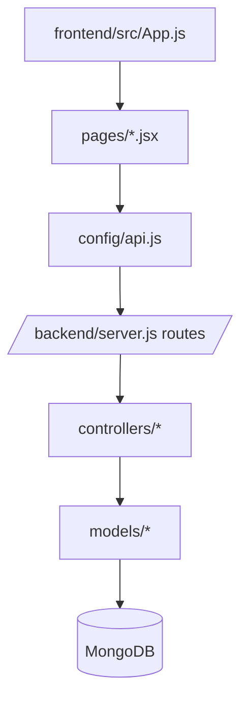

# FULL FOLDER STRUCTURE EXPLAINED

## Repository root

### `/backend`
**Why it exists**: isolated Node/Express service for API and persistence.

**Architectural role**: stateless HTTP API boundary with authentication and business logic.

#### `/backend/config`
- `db.js`: initializes MongoDB connection (`mongoose.connect(process.env.MONGO_URI)`).
- Removing this breaks startup persistence and the process exits early.

#### `/backend/controllers`
- `authController.js`: register/login handlers; hashes passwords and signs JWT.
- `taskController.js`: task CRUD handlers with validation and query filtering.
- Removing controllers disconnects route entrypoints from business logic.

#### `/backend/middleware`
- `authMiddleware.js`: extracts bearer token, verifies JWT, hydrates `req.user`.
- Removing middleware exposes task routes or breaks protected access.

#### `/backend/models`
- `User.js`: user schema (`email`, `password`) + index.
- `Task.js`: task schema (`title`, `description`, `completed`, `priority`, `user`).
- Removing model files breaks ODM compilation and all DB operations.

#### `/backend/routes`
- `authRoutes.js`: `/register`, `/login` public auth endpoints.
- `taskRoutes.js`: protected CRUD task routes using `router.use(auth)`.

#### `/backend/server.js`
- Runtime API entrypoint: env validation, DB connect, security middleware, routes, health endpoint, and error handlers.

### `/frontend`
**Why it exists**: isolated React SPA for browser interaction.

**Architectural role**: rendering/auth UX state and API orchestration.

#### `/frontend/src`
- `index.js`: React root bootstrap in strict mode.
- `App.js`: route graph + route guards (`ProtectedRoute`, `PublicRoute`).
- `config/api.js`: axios config, endpoint constants, auth header utility.

#### `/frontend/src/pages`
- `Landing.jsx`: marketing/entry CTA screen.
- `Login.jsx`: auth form; stores JWT.
- `Register.jsx`: signup form; validation and redirect to login.
- `Dashboard.jsx`: task CRUD UI, filtering, API sync, token-based access.
- CSS files define page-scoped styling and responsive behavior.

#### `/frontend/src/components`
- `ErrorBoundary.jsx`: catches rendering errors and offers safe reset to home.

#### `/frontend/public`
- `index.html`: SPA shell root.
- `manifest.json`/icons/robots: standard static assets.

### `/.github`
- Issue templates and PR template: contributor workflow scaffolding.

### Root docs
- `README.md`: product + setup + API guidance.
- `DEPLOYMENT.md`: hosting and environment variable steps.
- `CONTRIBUTING.md`: contribution process and style conventions.
- `CHANGELOG.md`: release change history.

## Dependency communication map

## Naming conventions
- `controllers/`, `routes/`, `middleware/`, `models/` follow common Express modular architecture.
- Frontend `pages/` and `components/` split route-level vs reusable UI behavior.
- `config/` in both apps centralizes environment-dependent concerns.
