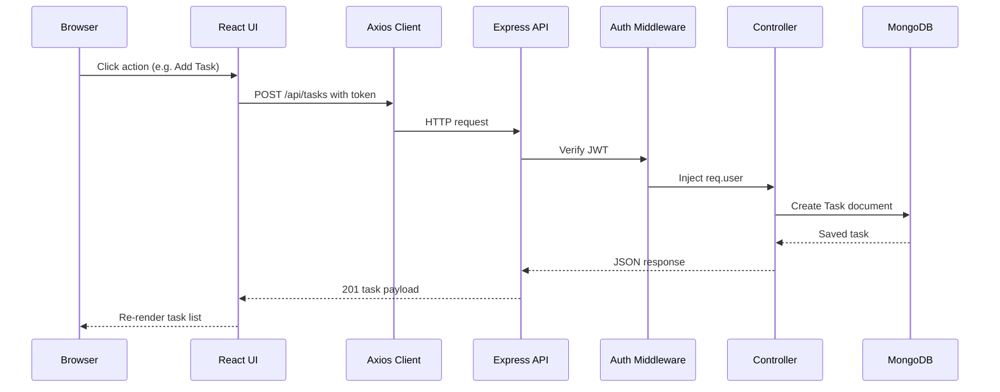

# PROJECT OVERVIEW

## What this project does
TaskMaster is a MERN-style task management platform with:
- **Frontend**: React SPA for signup/login and task operations
- **Backend**: Express API with JWT auth and protected CRUD routes
- **Database**: MongoDB via Mongoose models (`User`, `Task`)

Core user value: a user can register, authenticate, and manage personal tasks (create/read/update/delete) with priority and completion status.

## Business purpose and target users
- **Purpose**: personal productivity tracking and lightweight task planning.
- **Primary users**: students, freelancers, early-stage teams, and portfolio/demo evaluators.
- **Industry category**: productivity SaaS / project management-lite.

## Why someone would build this
- Fast path to production-ready full-stack fundamentals
- Demonstrates modern web app capabilities: auth, CRUD, protected routes, API integration, deployment docs
- Serves as an interview/portfolio project that maps to real SaaS architecture patterns

## Typical user journey
1. Land on marketing page (`/`)
2. Register (`/register`) or log in (`/login`)
3. Receive/store JWT token in localStorage
4. Enter protected dashboard (`/dashboard`)
5. Create tasks with title/description/priority
6. Filter tasks (all/pending/completed)
7. Toggle completion or delete tasks
8. Logout (token removed)

## High-level architecture

```mermaid
flowchart LR
  U[Browser User] --> FE[React SPA]
  FE -->|HTTP JSON + ****** BE[Express API]
  BE -->|Mongoose ODM| DB[(MongoDB)]
```

## Request lifecycle overview



## Frontend / backend / database / devops relationship
- **Frontend** owns presentation, navigation, and client state.
- **Backend** owns validation, auth, business rules, and persistence orchestration.
- **Database** stores users/tasks with user-level isolation through `user` ObjectId references.
- **DevOps layer** (documented in `DEPLOYMENT.md`) separates frontend and backend hosting and binds them with environment variables (`REACT_APP_API_URL`, `FRONTEND_URL`).

## Production analogs
Similar architecture style is common in:
- Trello-lite clones
- Notion-lite/task planners
- Internal productivity dashboards in startups
